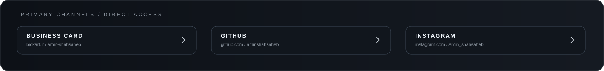

<div align="center">


<br>

# AMIN SHAHSÂHEB

### BUSINESS × TECHNOLOGY × AI × MARKETS

<sub>Building useful things where strategy, products, systems and machine intelligence meet.</sub>

<br><br>



</div>

<br>

---

## 01 / IDENTITY

<table>
<tr>
<td width="58%">

### THE PERSON BEHIND THE SYSTEM

I work across **business, technology, markets, design and AI** — moving between the high-level question of *what should exist* and the low-level question of *how to make it exist*.

I prefer work that can leave the screen and become something real: a product, a business system, a technical artifact, a brand, an analytical workflow, or an experiment with observable behavior.

> **Understand the field → design the system → build the thing → observe reality → verify the claim.**

</td>
<td width="42%">

```text
FIELD
  ↓
MODEL
  ↓
ARCHITECTURE
  ↓
EXECUTION
  ↓
OBSERVATION
  ↓
EVIDENCE
```

**OPERATING PRINCIPLE**

Ideas are cheap.
Systems with observable behavior are where the work begins.

</td>
</tr>
</table>

---

## 02 / THE WORKING FIELD


The four disciplines are not separate identities. They are the working field around a deeper technical thread: **Fānus**.

### A SIMPLE MODEL

| DOMAIN | FUNCTION | OUTPUT |
|---|---|---|
| **BUSINESS** | Strategy · Development · Marketing · Sales | Opportunities & ventures |
| **TECHNOLOGY** | Software · Products · Systems | Working infrastructure |
| **AI** | Human–AI interaction · Continuity · Verification | New interaction models |
| **MARKETS** | Research · Analysis · Systematic thinking | Decisions & signals |

---

## 03 / FĀNUS

### THE DEEPEST TECHNICAL THREAD

**Fānus** is the central research/engineering direction in my public work — an evolving system exploring **continuity, context, verification, relational AI and human agency**.

The important part is not the name. It is the architecture behind it: different responsibilities stay visible instead of collapsing into one opaque product.

```text
                         FĀNUS
                           │
                    CANONICAL CORE
                    LIVING SEAL
                           │
          ┌────────────────┼────────────────┐
          │                │                │
        APP             PRESENCE         BLUEPRINT
     EXPERIENCE        VERIFICATION      INSPECTION
          │                │                │
     converse            observe          visualize
```

### THE FOUR SURFACES

<table>
<tr>
<td width="50%">

**01 — LIVING SEAL**  
Canonical protocol, research and engineering foundation.

</td>
<td width="50%">

**02 — FĀNUS APP**  
Conversation, context and continuity experience.

</td>
</tr>
<tr>
<td>

**03 — FĀNUS PRESENCE**  
Public presence, verification and runtime observation.

</td>
<td>

**04 — FĀNUS BLUEPRINT**  
Visual engineering, architecture and system inspection.

</td>
</tr>
</table>

<p align="center">
<a href="https://github.com/aminshahsaheb/Fanus-Living-Seal"><b>LIVING SEAL</b></a> &nbsp; / &nbsp;
<a href="https://github.com/aminshahsaheb/fanus-app"><b>APP</b></a> &nbsp; / &nbsp;
<a href="https://github.com/aminshahsaheb/fanus-presence"><b>PRESENCE</b></a> &nbsp; / &nbsp;
<a href="https://github.com/aminshahsaheb/fanus-blueprint"><b>BLUEPRINT</b></a>
</p>

<details>
<summary><b>WHY THE SEPARATION MATTERS</b></summary>

<br>

- **Canonical truth** is not the same thing as presentation.
- **Experimentation** is not the same thing as a production claim.
- **Interface** is not the same thing as infrastructure.
- **Continuity** should not become captivity.
- **Visual presence** should not be mistaken for backend proof.

The architecture keeps those boundaries explicit. The result is a system that can be inspected instead of merely presented.

</details>

---

## 04 / OPERATING SYSTEM


I am interested in the point where an idea stops being a concept and becomes a **system with observable behavior**.

That means I repeatedly return to:

**clarity · boundaries · evidence · iteration · usefulness · legibility**

The loop does not end at launch:

```text
BUILD → OBSERVE → VERIFY → REFINE → BUILD AGAIN
```

---

## 05 / VISUAL LANGUAGE

### PERSIAN FORM × COMPUTATIONAL ORDER

The visual system of this profile is deliberately built from two vocabularies.

**Persian geometric language** — proportion, repetition, symmetry, arch structures, radial stars and patterns capable of extending beyond a single frame.

**Modern computation** — grids, nodes, signals, state, traces, interfaces and inspectable relationships.

The goal is not historical imitation. It is translation.

> **Old structural intelligence, expressed through a contemporary technical language.**

Every diagram, frame and mark is intended to behave like part of the same system — not like decoration placed around the text.

---

## 06 / WHAT I BUILD

<table>
<tr>
<td width="25%" align="center">

### BUSINESS

Development  
Strategy  
Marketing  
Sales

</td>
<td width="25%" align="center">

### TECHNOLOGY

Software  
Digital Products  
Technical Systems  
Infrastructure

</td>
<td width="25%" align="center">

### AI

Human–AI  
Continuity  
Verification  
Emerging Systems

</td>
<td width="25%" align="center">

### MARKETS

Research  
Analysis  
Signals  
Systematic Thinking

</td>
</tr>
</table>

**Also:** digital experiences · brand identity · practical software · research prototypes · analytical workflows · emerging products.

---

## 07 / DESIGN RULES

<table>
<tr>
<td width="50%">

**HONESTY OVER PERFORMANCE**  
An interface should not claim more than its system can support.

**CONTINUITY WITHOUT CAPTIVITY**  
Context should help without becoming control.

**HUMAN AGENCY**  
The human remains central to the interaction and its data.

</td>
<td width="50%">

**CONTEXT OVER NOISE**  
Preserve what matters instead of adding complexity for its own sake.

**ONE TRUTH, MULTIPLE SURFACES**  
Separate canonical state from the interfaces that expose it.

**LEGIBILITY**  
A system becomes more useful when its structure can be understood.

</td>
</tr>
</table>

---

## 08 / CURRENT AXIS

<div align="center">

```text
BUSINESS
    ×
TECHNOLOGY
    ×
AI
    ×
MARKETS
    │
    ▼
USEFUL THINGS
    │
    ▼
OBSERVABLE SYSTEMS
```

**FIND SOMETHING USEFUL → UNDERSTAND THE SYSTEM → BUILD → TEST → MAKE IT LEGIBLE**

</div>

---

## 09 / SELECTED WORK

<table>
<tr>
<td width="50%">

### FĀNUS / LIVING SEAL

Canonical research and engineering direction around continuity, context, verification and human–AI systems.

</td>
<td width="50%">

### FĀNUS / APPLICATION

A user-facing experience for conversation, context and continuity — deliberately separated from the canonical core.

</td>
</tr>
<tr>
<td>

### FĀNUS / PRESENCE

A public presence and verification surface built around observable runtime state rather than simulated certainty.

</td>
<td>

### FĀNUS / BLUEPRINT

A visual engineering surface for architecture, state, API, ledger, migration and system inspection.

</td>
</tr>
</table>

---

## 10 / DIRECT ACCESS

<div align="center">

<a href="https://biokart.ir/amin-shahsaheb"><b>BUSINESS CARD</b></a>
&nbsp;&nbsp;·&nbsp;&nbsp;
<a href="https://github.com/aminshahsaheb"><b>GITHUB</b></a>
&nbsp;&nbsp;·&nbsp;&nbsp;
<a href="https://www.instagram.com/Amin_shahsaheb"><b>INSTAGRAM</b></a>
&nbsp;&nbsp;·&nbsp;&nbsp;
<a href="https://wa.me/989198818465"><b>WHATSAPP</b></a>
&nbsp;&nbsp;·&nbsp;&nbsp;
<a href="https://t.me/Kingsaheb"><b>TELEGRAM</b></a>

<br><br>

<sub>AMIN SHAHSÂHEB · BUILD · CONNECT · VERIFY</sub>

<br>

<sub>Best Never Rest</sub>

</div>
