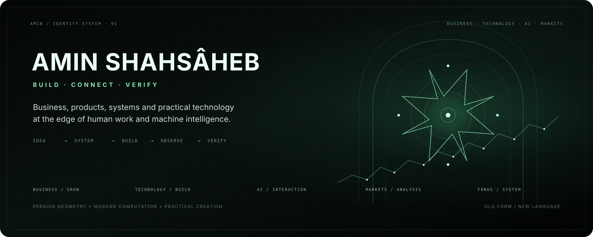
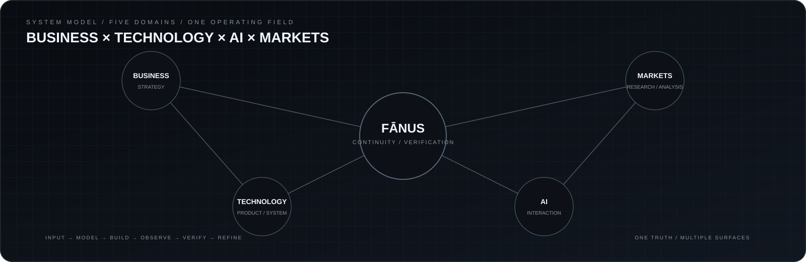
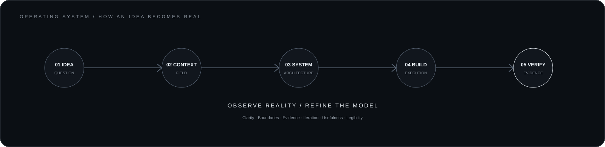
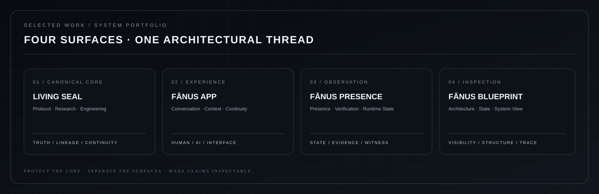
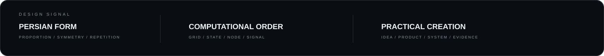

<div align="center">



</div>

<p align="center"><sub>BUSINESS · TECHNOLOGY · AI · MARKETS</sub></p>

I work between **strategy and execution** — shaping businesses, digital products, technical systems and emerging human–AI work.

The common thread is simple:

> **Understand the field → design the system → build the thing → observe reality → verify the claim.**

---

## The work, with something behind it

I prefer a profile to behave less like a biography and more like a **working record**: what I build, where it lives, how the pieces relate, and what can actually be inspected.

| Area | What I work on | Evidence / surface |
|---|---|---|
| **Business** | Development, strategy, marketing, sales and practical growth | [BioKart](https://biokart.ir/amin-shahsaheb) |
| **Technology** | Digital products, software, architecture and technical systems | [GitHub](https://github.com/aminshahsaheb) |
| **AI** | Human–AI interaction, continuity, context, verification and emerging systems | [Fānus](https://github.com/aminshahsaheb/Fanus-Living-Seal) |
| **Markets** | Research, analysis and systematic thinking | Ongoing work |
| **Brand / Design** | Positioning, visual identity and product language | Across projects |

---

## A field of five domains



The domains are not separate identities. They are different views of the same operating field.

**Business** asks what should exist and why.  
**Technology** asks how it can exist.  
**AI** asks how people and machines interact around it.  
**Markets** test assumptions against reality.  
**Fānus** is the deepest technical thread where these questions meet around continuity, context and verification.

---

# FĀNUS

Fānus is the most sustained research and engineering direction in my work.

It explores a practical question:

**How can a human–AI system preserve context and continuity without turning continuity into captivity, and without asking the user to trust claims that cannot be checked?**

The important part is not one interface or one repository. It is the separation between **canonical truth** and the surfaces that expose, use or inspect it.

### One core. Multiple surfaces.

```text
                         FANUS-LIVING-SEAL
                         CANONICAL CORE
                               │
             ┌─────────────────┼─────────────────┐
             │                 │                 │
             ▼                 ▼                 ▼
         FANUS APP        FANUS PRESENCE     BLUEPRINT
       conversation       verification       inspection
          context          runtime state      architecture
             │                 │                 │
             └─────────────────┴─────────────────┘
                         separate surfaces
                         / one truth model
```

### The four surfaces

| Surface | Role | Principle |
|---|---|---|
| **Living Seal** | Canonical protocol, research and engineering foundation | Protect the source of truth |
| **Fānus App** | Conversation, context and continuity experience | Continuity without captivity |
| **Fānus Presence** | Public presence, verification and runtime observation | Show real state, never fabricate it |
| **Fānus Blueprint** | Visual engineering and system inspection | Make architecture visible |

The separation matters because a visual surface should not quietly become the source of truth, and an interface should not pretend that a simulation is a live system.

---

## How I operate



I tend to work in a loop rather than a straight line:

**Question → Context → Architecture → Build → Evidence → Refine**

The final step is important. Reality gets a vote.

---

## Selected work



The projects above are deliberately separated by role:

- **Fanus-Living-Seal** — canonical core and long-form technical research
- **fanus-app** — user-facing conversation and continuity
- **fanus-presence** — presence, verification and runtime observation
- **fanus-blueprint** — visual engineering and architecture inspection

The architecture is intentionally **not** four copies of the same system.

---

## Design language



I am interested in the point where **old structural language meets new computational language**.

Persian architectural and geometric traditions offer a vocabulary of proportion, repetition, symmetry, radial construction and controlled complexity.

I translate that vocabulary into a contemporary system language:

`grid · node · state · signal · trace · proportion · hierarchy`

Not decoration for its own sake.

**Form should explain structure.**

---

## Principles I keep returning to

**Honesty over performance**  
A system should not sound more certain than its evidence allows.

**Continuity without captivity**  
Context should help a person continue, not make them dependent on a single system.

**Human agency**  
Technology should expand a person’s ability to understand and act — not quietly replace that agency.

**Context over noise**  
Useful systems remember what matters and discard what does not.

**One truth, multiple surfaces**  
Different interfaces can expose the same system without creating competing versions of reality.

**Make claims inspectable**  
If something matters, there should be a path toward checking it.

---

## Current axis

**BUSINESS × TECHNOLOGY × AI × MARKETS**

I am interested in work that survives contact with reality:

**an idea that becomes a product,  
a product that becomes a system,  
a system that can be observed,  
and a claim that can be checked.**

---

## Direct access

[GitHub](https://github.com/aminshahsaheb) · [Instagram](https://www.instagram.com/Amin_shahsaheb) · [Business Card](https://biokart.ir/amin-shahsaheb)

<div align="center">
<sub>STRATEGY → PRODUCT → SYSTEM → OBSERVATION → VERIFICATION</sub>
<br>
**Best Never Rest**
</div>