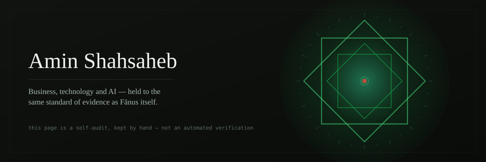

<div align="center">



</div>

Fānus doesn't let a claim stand without something to check it against. This page holds itself to the same rule: not a biography, but a ledger — a claim, and the evidence for it, side by side. Kept by hand, not run by a script.

## The ledger

| Claim | Evidence |
|---|---|
| Building Fānus — a research and engineering system for AI reliability, memory, continuity and governance | [Fanus-Living-Seal](https://github.com/aminshahsaheb/Fanus-Living-Seal) |
| It has a conversational front end | [fanus-app](https://github.com/aminshahsaheb/fanus-app) |
| It has a public verification surface, live | [fanus-presence](https://github.com/aminshahsaheb/fanus-presence) → [running](https://fanus-presence.vercel.app) |
| It has a visual engineering blueprint | [fanus-blueprint](https://github.com/aminshahsaheb/fanus-blueprint) → [running](https://fanus1.netlify.app) |
| Business development, strategy, marketing and sales, in practice | [BioKart](https://biokart.ir/amin-shahsaheb) |

Also standing focus, with no single link to point at yet: financial-market research and systematic thinking, brand and visual identity, and the wider question of what makes a human–AI system trustworthy rather than merely fluent.

## How the pieces relate

Fānus has one canonical core and separate surfaces around it. The surfaces move faster than the core, but none of them get to quietly redefine it.

```text
                     Fanus-Living-Seal
                       (canonical core)
                             │
              ┌──────────────┴──────────────┐
              │                             │
          fanus-app                   fanus-presence
       (talks to it)               (shows it working)
```

`fanus-blueprint` sits beside this as its own, clearly-labelled visual surface — it shows the architecture, not a live backend, and says so on its own front page.

## Reach

[](https://github.com/aminshahsaheb)
[](https://www.instagram.com/Amin_shahsaheb)
[](https://wa.me/989198818465)
[](https://t.me/Kingsaheb)
[](https://biokart.ir/amin-shahsaheb)

---

<p align="center"><sub>A personal claim-and-evidence ledger, written by hand — not an automated audit.</sub></p>
<p align="center"><sub>Best Never Rest</sub></p>
