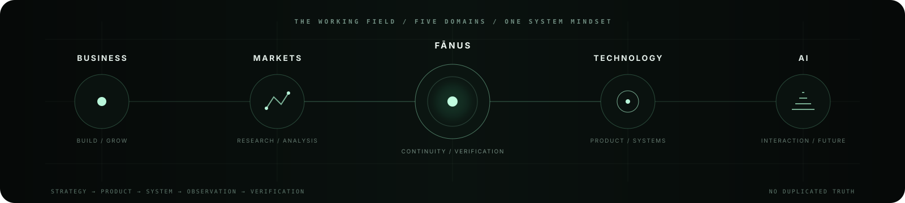

<div align="center">


# AMIN SHAHSÂHEB

**Business × Technology × AI × Markets**  
<sub>Building useful things where strategy, products, systems and machine intelligence meet.</sub>

<p>
<a href="https://biokart.ir/amin-shahsaheb">Business Card</a> ·
<a href="https://github.com/aminshahsaheb">GitHub</a> ·
<a href="https://www.instagram.com/Amin_shahsaheb">Instagram</a>
</p>

</div>

---



## ◈ THE PERSON BEHIND THE WORK

I work across **business, technology, markets, design and AI** — moving between the high-level question of *what should exist* and the low-level question of *how to make it exist*.

My preference is practical:

> **Understand the field → design the system → build the thing → observe reality → verify the claim.**

That thread runs through products, business projects, analytical work, brand systems and my deeper experiments with human–AI interaction.

---

## ⟡ FĀNUS — THE DEEPEST TECHNICAL THREAD

**Fānus** is the central research/engineering direction in my public work: an evolving system exploring **continuity, context, verification, relational AI and human agency**.

It is intentionally separated into distinct surfaces rather than treated as one monolith:

```text
                         FĀNUS
                           │
             ┌─────────────┴─────────────┐
             │                           │
      LIVING SEAL                   EXPERIENCE
      canonical core                  surfaces
             │               ┌───────────┼───────────┐
             │               │           │           │
             └──────────── APP        PRESENCE    BLUEPRINT
                              │           │           │
                          converse      verify      inspect
```

### The four surfaces

| Surface | What it is |
|---|---|
| **Living Seal** | Canonical protocol, research and engineering foundation |
| **Fānus App** | Human-facing conversation, context and continuity experience |
| **Fānus Presence** | Public presence, verification and runtime observation |
| **Fānus Blueprint** | Visual engineering, architecture and system inspection |

<p align="center">
<a href="https://github.com/aminshahsaheb/Fanus-Living-Seal">LIVING SEAL →</a> ·
<a href="https://github.com/aminshahsaheb/fanus-app">APP →</a> ·
<a href="https://github.com/aminshahsaheb/fanus-presence">PRESENCE →</a> ·
<a href="https://github.com/aminshahsaheb/fanus-blueprint">BLUEPRINT →</a>
</p>

<details>
<summary><strong>WHY THE SEPARATION MATTERS</strong></summary>

The architecture keeps different responsibilities visible:

- **canonical truth** is not the same thing as presentation
- **experimentation** is not the same thing as a production claim
- **interface** is not the same thing as infrastructure
- **continuity** should not become captivity
- **visual presence** should not be mistaken for backend proof

The Fānus repositories repeatedly return to the same discipline: make the boundary between what is real, what is experimental, and what is merely represented as clear as possible.

</details>

---

## ◆ HOW I THINK ABOUT BUILDING

```text
        IDEA
          ↓
       CONTEXT
          ↓
     ARCHITECTURE
          ↓
        BUILD
          ↓
       OBSERVE
          ↓
       VERIFY
          ↓
       REFINE
```

I am interested in the point where an idea stops being a concept and becomes a **system with observable behavior**.

That means I care about:

**clarity · boundaries · evidence · iteration · usefulness · legibility**

---

## ✦ A VISUAL LANGUAGE OF MY OWN

The profile is deliberately built from two design vocabularies.

**Persian geometric language** — proportion, repetition, symmetry, the arch, radial stars and patterns that continue beyond the edge of a single frame.

**Modern computation** — grids, signals, nodes, state, traces, interfaces and inspectable systems.

The intention is not historical imitation. It is translation:

> **Persian geometry × modern computation.**  
> Old structural ideas, expressed through a contemporary technical language.

The geometric vocabulary is grounded in a real design tradition in which circles, squares, polygons and star constructions were combined, repeated and interlaced into highly structured patterns. citeturn0search0turn0search25

---

## ⚙ WHAT I BUILD / WORK ON

<table>
<tr>
<td width="50%">

**BUSINESS**  
Development · Strategy · Marketing · Sales

</td>
<td width="50%">

**TECHNOLOGY**  
Software · Digital Products · Technical Systems

</td>
</tr>
<tr>
<td>

**AI**  
Human–AI Interaction · Continuity · Verification

</td>
<td>

**MARKETS**  
Research · Analysis · Systematic Thinking

</td>
</tr>
</table>

<br>

**Also:** digital experiences · brand identity · practical software · research prototypes · analytical workflows · emerging products.

---

## ◇ THE PRINCIPLES I KEEP RETURNING TO

| Principle | Meaning in the work |
|---|---|
| **Honesty over performance** | Don't make an interface claim more than the system can support. |
| **Continuity without captivity** | Context should help without becoming control. |
| **Human agency** | The human remains central to the interaction and its data. |
| **Context over noise** | Preserve what matters instead of adding complexity for its own sake. |
| **One truth, multiple surfaces** | Separate canonical state from the interfaces that expose it. |

---

## ▣ CURRENT AXIS

```text
BUSINESS
    ×
TECHNOLOGY
    ×
AI
    ×
MARKETS
```

The common thread is simple:

**find something useful → understand the system around it → build → test → make it legible.**

---

## ⟐ CONNECT

<div align="center">

<a href="https://biokart.ir/amin-shahsaheb">BUSINESS CARD</a> ·
<a href="https://www.instagram.com/Amin_shahsaheb">INSTAGRAM</a> ·
<a href="https://wa.me/989198818465">WHATSAPP</a> ·
<a href="https://t.me/Kingsaheb">TELEGRAM</a> ·
<a href="https://github.com/aminshahsaheb">GITHUB</a>

<br><br>

<sub>Best Never Rest</sub>

</div>
