

<h1 align="center">Amin Shahsaheb</h1>

<strong>Business systems · Digital products · Applied AI · Market research</strong>

An independent builder working across strategy, architecture, products and evidence.

<table>
<tr>
<td width="50%" align="center"><a href="https://biokart.ir/amin-shahsaheb">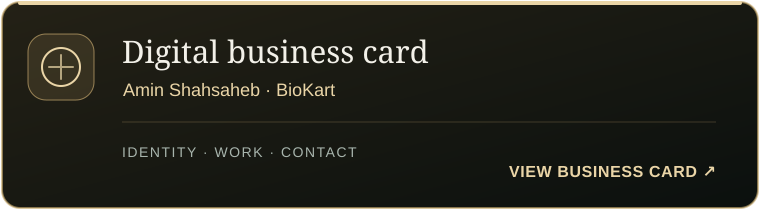</a></td>
<td width="50%" align="center"><a href="https://github.com/aminshahsaheb?tab=repositories">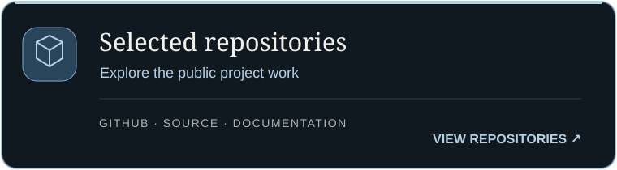</a></td>
</tr>
</table>

<table>
<tr>
<td width="33%" align="center"><a href="#about">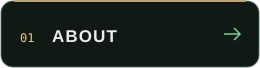</a></td>
<td width="33%" align="center"><a href="#the-working-field">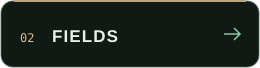</a></td>
<td width="33%" align="center"><a href="#selected-work">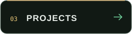</a></td>
</tr>
<tr>
<td width="33%" align="center"></td>
<td width="33%" align="center"><a href="#principles">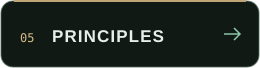</a></td>
<td width="33%" align="center"></td>
</tr>
</table>

---

## About

I work across business and technology. I turn complex questions into useful systems, digital products and evidence-led decisions.

My work follows one principle:

> **Build with intent. Verify with care.**

I value clear thinking, useful design, sound engineering and honest reporting. I aim to make each system understandable, testable and useful.

---

## The working field

I work in three areas. Each has a different purpose and a clear boundary.

- **Human–AI systems** — context, continuity, human agency and verification.
- **Business software** — operations, workspaces and tools for different industries.
- **Market research** — testable hypotheses, risk controls and reproducible evidence.

## Selected work

### 01 — Fānus · Human–AI systems

<a href="https://github.com/aminshahsaheb/Fanus-Living-Seal">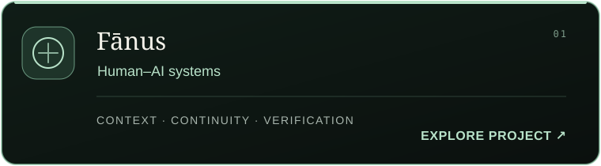</a>

A research and engineering project about honest, inspectable human–AI interaction.

Fānus explores how useful context can continue across interactions without creating dependence. It separates the core protocol and engine from the experiences that use them.

- **Living Seal** — protocol, research, runtime and verification foundation.
- **Fānus App** — conversation and continuity experience.
- **Fānus Presence** — public presence and runtime observation.
- **Fānus Blueprint** — visual system architecture and inspection.

**Guiding principle:** Continuity without captivity.

<table>
<tr>
<td width="50%"></td>
<td width="50%"></td>
</tr>
<tr>
<td width="50%"></td>
<td width="50%"></td>
</tr>
</table>

### 02 — MarketFa · Business software

<a href="https://github.com/aminshahsaheb/marketfa-platform">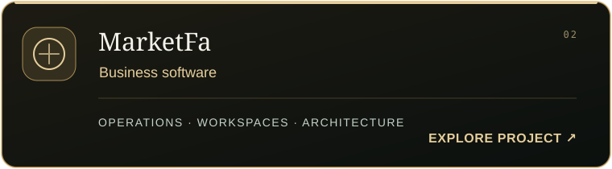</a>

A multi-industry business platform. A person should be able to select an occupation and use a workspace that reflects the needs of that business.

The architecture aims to separate shared identity and tenant services from business-specific rules and workflows.

**Current boundary:** Core tenant and identity administration work is present. Authentication-provider integration, browser login and recovery, accounting implementation, and industry-specific workflows are not complete. The project is not production-ready for live financial records.

### 03 — BTC Signal Lab · Market research

<a href="https://github.com/aminshahsaheb/btc-signal-lab">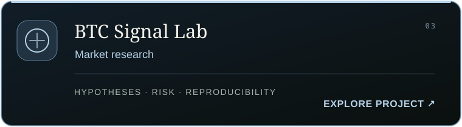</a>

A research workspace for testing Bitcoin market hypotheses. It separates movement timing, directional hypotheses, risk checks and execution validation.

The project uses reproducible data handling, documented decisions and pre-defined evidence gates.

**Current boundary:** No strategy is established as profitable or independently validated. Some research components remain drafts or historical artifacts. A statistical result or a passing engineering check is not proof of a trading edge.

---

## How I work

1. **Understand** the problem, context and constraints.
2. **Frame** the scope, users, assumptions and success criteria.
3. **Design** the architecture, responsibilities and boundaries.
4. **Build** in small, reviewable and testable steps.
5. **Verify** the result, record evidence and revise the model.

A finished interface does not prove that a system works. A passing test does not prove that a product has market fit. Each claim needs the right evidence.

## Visual language

I use Persian geometric proportion as a source of structure: symmetry, radial forms, measured spacing and connected patterns. I combine these ideas with grids, nodes and traces.

The goal is not decoration. The visual system should make the underlying relationships easier to see.

## Principles

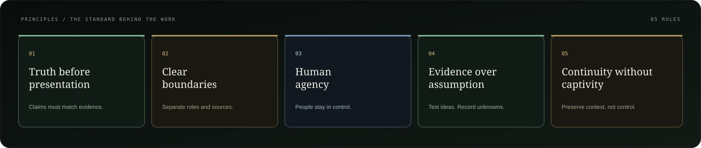

---

## Connect

A clear route for each kind of conversation. Choose the channel that fits your message.

<table>
<tr>
<td width="50%"><a href="https://www.instagram.com/Amin_shahsaheb">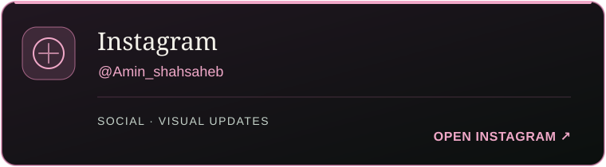</a></td>
<td width="50%"></td>
</tr>
<tr>
<td width="50%"><a href="https://t.me/Kingsaheb">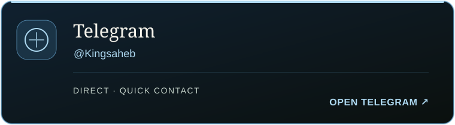</a></td>
<td width="50%"></td>
</tr>
</table>

**Best Never Rest**

Strategy → Architecture → Product → Evidence

